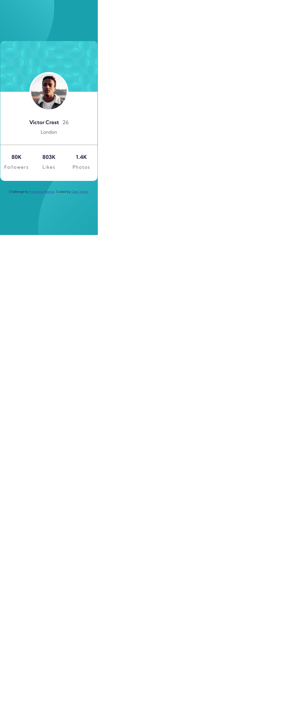

# Frontend Mentor - Profile card component solution

This is a solution to the [Profile card component challenge on Frontend Mentor](https://www.frontendmentor.io/challenges/profile-card-component-cfArpWshJ). Frontend Mentor challenges help you improve your coding skills by building realistic projects.

## Table of contents

- [Overview](#overview)
  - [The challenge](#the-challenge)
  - [Screenshot](#screenshot)
  - [Links](#links)
- [My process](#my-process)
  - [Built with](#built-with)
  - [What I learned](#what-i-learned)
  - [Continued development](#continued-development)
- [Author](#author)
- [Acknowledgments](#acknowledgments)

## Overview

### The challenge

- Build out the project to the designs provided

### Screenshot



### Links

- Solution URL: [Add solution URL here](https://your-solution-url.com)
- Live Site URL: [Add live site URL here](https://your-live-site-url.com)

## My process

### Built with

- CSS custom properties and variables
- Flexbox
- Mobile-first workflow

### What I learned

The aspect of this project that I spent the most time on was the use of the two background images and the background color for the body of the site. I spent a lot of time learning about the differnet attribute of setting these two seperate background images and gett the size and positioning just right to match the design. Then I had to adjust this slightly for the background to come out correct in the desktop layout.

```css
body {
  font-family: 'Kumbh Sans', sans-serif;
  background-color: var(--color-dark-cyan);
  background-image: url('images/bg-pattern-top.svg'),
    url('images/bg-pattern-bottom.svg');
  background-repeat: no-repeat;
  background-position: -95vw -70vw, 40vw 135vw;
  background-size: 150%;
  background-attachment: fixed;
  background-blend-mode: luminosity;
  color: var(--color-dark-blue);
}
```

### Continued development

Each project offers a new challenge. This one offered the challenge of the multiple background image and the usage of both along with the adding element of the color. the ability to properly set the positioning of backgrounds was the first challenge. Also, the usage of the proper units (e.g.; vw, px, etc) was key. I decided to use vw. Still not sure that was the best choice but it did seem to work. I will continue to learn more about the usage of a variety of units to get better at creating layouts that respond well to changes in viewport.

## Author

- Website - [Glen Taylor](https://www.glenmtaylor.com)
- Frontend Mentor - [@chiptaylor](https://www.frontendmentor.io/profile/chiptaylor)
- Twitter - [@leaderchip](https://www.twitter.com/leaderchip)
